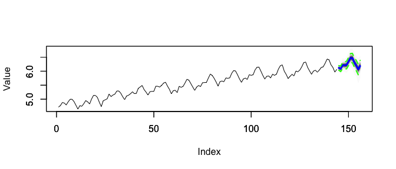
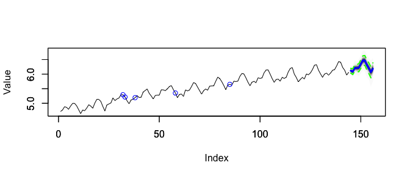
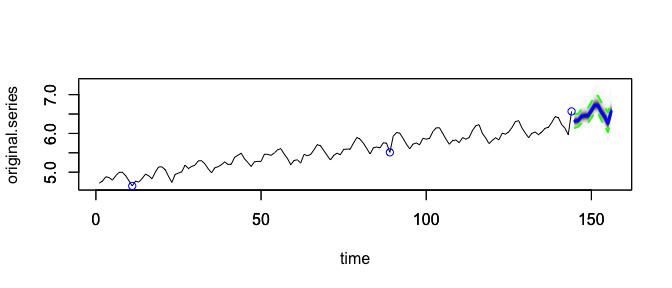
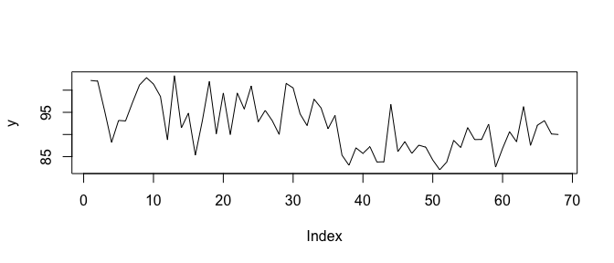

<!-- README.md is generated from README.Rmd. Please edit that file -->

# explainer

<!-- badges: start -->
<!-- badges: end -->

The `explainer` package is a case study of how structural time series
models (as provided by, for example, the `bsts` package) can be
summarized in words for easier interpretation.

While structural time series models are inherently interpretable, it can
be tedious to inspect their parameters to understand what the model has
derived from the data. The textual summaries provided by `explainer`
make the interpretation more approachable.

## Installation

You can install the development version of explainer from
[GitHub](https://github.com/) with:

``` r
# install.packages("devtools")
devtools::install_github("timradtke/explainer")
```

## Getting Started

### Fit BSTS on AirPassengers

Since we aim to describe a model fitted with the `bsts` package, we load
both `bsts` and `explainer`.

``` r
library(bsts)
library(explainer)
```

Let’s use the Air Passengers data as simplest example on which we fit
the model that we want to explain in the next step.

``` r
y <- log(AirPassengers)
ss <- AddSemilocalLinearTrend(list(), y)
ss <- AddSeasonal(ss, y, nseasons = 12)

model <- bsts(
  formula = y, 
  state.specification = ss,
  niter = 5000,
  ping = 0
)

pred <- predict(model, horizon = 12, burn = 1000)
```

This is the model’s forecast for the next year on the log-transformed
scale:



### Explain the Model and its Forecast

To explain the model, we only need to provide the fitted model object
(not the forecast) to the `explain()` function. As usual for the `bsts`
package, we also provide the `burn` parameter. The `seasonality` can be
inferred from the model object, but one can also explicitly provide it
alongside the `start_period` which indicates in which month of the year
the series begins (in the case of yearly seasonality and monthly data).

Note: The paragraphs after the code chunk up to the horizontal line are
the “pretty-printed” explanation object.

``` r
explanation <- explain(
  object = model,
  burn = 1000,
  seasonality = 12,
  start_period = 1
)
print(explanation)
```

The chosen model takes into account seasonality and allows for a
long-run trend with short-term fluctuation around said trend.

The model explains most of the observed variation in the series at hand.
This indicates that the series contains signals such as trend or
seasonality, but it doesn’t guarantee that the model’s forecast projects
them appropriately into the future.

Historically, the model has predicted the series at hand better than
both the current year’s runrate, and the value from a year ago. It
captures historical patterns that simple benchmarks do not.

The current level of the series is higher than the average level
observed in the history of the series, and higher than a year ago. The
current level is neither clearly decreasing nor clearly increasing.

Trend and seasonality dominate other variation in the series. The
forecast is largely driven by these two signals. Within a given year,
the seasonal variation will dominate the change caused by the trend.

The model estimates a positive long-run trend which determines the
long-term forecast.

The series’ seasonality is expected to pull down next month’s
observation, similar to a year ago.

The forecast uncertainty is largely driven by fluctuations in the level
of the time series. The level of the time series fluctuated historically
both due to noise and due to changes in the trend.

Over the course of the series, there has been a single anomaly 11.1
years ago.

------------------------------------------------------------------------

Alternatively, one can also investigate individual components of the
explanation object. The explanation is a list of the following
components:

``` r
names(explanation)
#>  [1] "components"         "model"              "length"            
#>  [4] "variance_reduction" "goodness_of_fit"    "benchmark"         
#>  [7] "current_level"      "strengths"          "long_run_trend"    
#> [10] "upcoming_season"    "innovation"         "anomalies"         
#> [13] "family"
```

Some components consist of additional information besides the
description itself. For example, the `benchmark` component also lists
the top 5 observations for which the model performed better (or worse)
than benchmark comparison models.

``` r
explanation$benchmark
#> $explanation
#> [1] "Historically, the model has predicted the series at hand better than both the current year's runrate, and the value from a year ago. It captures historical patterns that simple benchmarks do not."
#> 
#> $gof_snaive
#> [1] 0.5398582
#> 
#> $gof_runrate
#> [1] 0.9071414
#> 
#> $better_than_snaive
#> [1] 33 85 38 58 32
#> 
#> $better_than_runrate
#> [1] 33 58 95 32 91
#> 
#> $worse_than_snaive
#> integer(0)
#> 
#> $worse_than_runrate
#> integer(0)
```

This can be helpful to reference certain observations when plotting the
data alongside the explanation:



## Description of Anomalies

The `explain()` function also identifies possibly anomalous historical
observations (given the model fitted on the historical data). This can
be especially helpful when dealing with recent anomalies.

Let’s first add some anomalies to the otherwise very clean example data;
we can then repeat training the model as before.

``` r
y[length(y)] <- y[length(y)] + 0.5
y[length(y) - 55] <- y[length(y) - 55] - 0.25

ss <- AddSemilocalLinearTrend(list(), y)
ss <- AddSeasonal(ss, y, nseasons = 12)

model <- bsts(
  formula = y, 
  state.specification = ss,
  niter = 5000,
  ping = 0
)

pred <- predict(model, horizon = 12, burn = 1000)
```

We can re-create the explanation and focus on the adjusted explanation
of the anomalies:

``` r
explanation <- explain(
  object = model,
  burn = 1000,
  start_period = 1
)

print(explanation$anomalies)
#> $explanation
#> [1] "The most recent observation has been identified as an anomaly. That observation might disturb the forecast. It could also indicate an upcoming level shift to which the forecast should adjust, but hasn't yet given too little evidence. There have been several other anomalies previously, the most recent one 4.6 years ago."
#> 
#> $anomalies
#> [1]  11  89 144
```

The `anomalies` component also provides information about the exact
location of the possible anomalies which we can use to plot them:



The forecast was in fact impacted by the outlier at the most recent
observation, as highlighted in the explanation.

## Explain Various Model Specifications

Structual time series models can take various forms as their components
can be arbitrarily mixed and matched. The `explain()` function is
currently limited to explaining at most two components used as state
specification via the `bsts::Add...()` functions. It is also limited to
the `gaussian` and `student` families, and models without regression
component.

To see the explanation of a model different from the one above, let’s
look at the Local Level model and a time series that follows that model.

### Local Level Model



We can fit the local level model to that time series:

``` r
ss <- bsts::AddLocalLevel(list(), y)

model <- bsts::bsts(
  y, 
  state.specification = ss, 
  niter = 5000, 
  ping = 0
)
```

Now, even though the model is fit without seasonal component, we can act
as if the data is observed monthly and thus could have a yearly
seasonality.

``` r
explanation <- explain(
  object = model,
  burn = 1000,
  seasonality = 12,
  start_period = 1
)
print(explanation)
```

The chosen model adjusts to changes in the level of the series. It does
not account for trends or seasonality.

The model explains a good share of the observed variation in the series
at hand.

Historically, the model has not predicted the series at hand better than
the current year’s runrate would have. However, since the model is a
Local-Level specification, this is not unexpected as it captures similar
effects as the runrate.

The current level of the series is lower than the average level observed
in the history of the series, and about as high as a year ago. The
current level is neither clearly decreasing nor clearly increasing.

The model does not project a long-run trend different from the current
trend.

The forecast uncertainty is largely driven by observation noise, more so
than by changes in level or seasonal effects.

No anomalous observations were detected in the history of the time
series.
